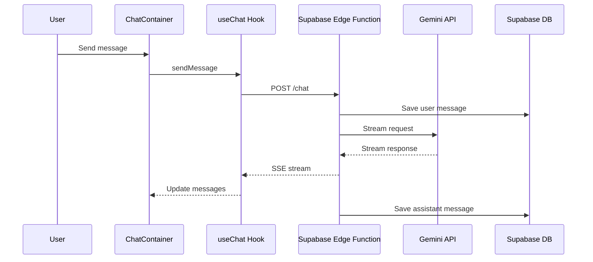

# Chat System Implementation Plan

## Overview

Implement a full-featured chat system for Car Insights AI based on the Vercel chatbot architecture, with conversation history stored in Supabase.

## Architecture Comparison

### Vercel Chatbot (Reference)
- **Framework**: Next.js with App Router
- **Database**: PostgreSQL with Drizzle ORM
- **AI SDK**: Vercel AI SDK with `useChat` hook
- **Streaming**: Server-sent events via API routes
- **Features**: Multi-model support, artifacts, tool calls, voting

### Car Insights AI (Target)
- **Framework**: Vite + React SPA
- **Database**: Supabase PostgreSQL
- **AI**: Google Gemini API
- **Streaming**: Supabase Edge Functions
- **Features**: Vehicle context integration, session data analysis

## Database Schema

### New Tables Required

```sql
-- Chat conversations
CREATE TABLE chat_conversations (
  id UUID PRIMARY KEY DEFAULT gen_random_uuid(),
  title TEXT NOT NULL,
  user_id UUID REFERENCES auth.users(id) ON DELETE CASCADE,
  car_profile_id UUID REFERENCES car_profiles(id) ON DELETE SET NULL,
  created_at TIMESTAMPTZ NOT NULL DEFAULT now(),
  updated_at TIMESTAMPTZ NOT NULL DEFAULT now()
);

-- Chat messages with parts-based structure
CREATE TABLE chat_messages (
  id UUID PRIMARY KEY DEFAULT gen_random_uuid(),
  conversation_id UUID NOT NULL REFERENCES chat_conversations(id) ON DELETE CASCADE,
  role TEXT NOT NULL CHECK (role IN ('user', 'assistant')),
  parts JSONB NOT NULL DEFAULT '[]',
  attachments JSONB NOT NULL DEFAULT '[]',
  created_at TIMESTAMPTZ NOT NULL DEFAULT now()
);

-- Indexes
CREATE INDEX idx_chat_conversations_user ON chat_conversations(user_id);
CREATE INDEX idx_chat_conversations_car ON chat_conversations(car_profile_id);
CREATE INDEX idx_chat_messages_conversation ON chat_messages(conversation_id);
```

## Component Architecture

```
src/
├── components/
│   ├── chat/
│   │   ├── ChatContainer.tsx      # Main chat wrapper
│   │   ├── ChatSidebar.tsx        # Conversation history
│   │   ├── MessageList.tsx        # Message display
│   │   ├── Message.tsx            # Individual message
│   │   ├── MessageInput.tsx       # Input with send button
│   │   ├── ThinkingIndicator.tsx  # Loading state
│   │   └── hooks/
│   │       └── useChatHistory.ts  # Supabase chat persistence
│   └── ChatBubble.tsx             # Floating trigger (updated)
├── lib/
│   └── chat/
│       ├── types.ts               # Chat message types
│       └── context.ts             # Vehicle context builder
└── supabase/
    └── functions/
        └── chat/
            └── index.ts           # Edge function for streaming
```

## Data Flow



## Implementation Steps

### Phase 1: Database Setup
1. Create migration file for chat tables
2. Enable RLS policies for user isolation
3. Add updated_at trigger for conversations

### Phase 2: Backend - Supabase Edge Function
1. Create `/functions/chat/index.ts`
2. Implement streaming with Gemini API
3. Handle conversation history retrieval
4. Save messages after streaming completes

### Phase 3: Frontend - Chat Components
1. Install `@ai-sdk/react` and `ai` packages
2. Create `ChatContainer` with `useChat` hook
3. Implement `MessageList` with markdown rendering
4. Build `MessageInput` with auto-resize textarea
5. Create `ChatSidebar` for history navigation

### Phase 4: Integration
1. Update `ChatBubble` to open full chat
2. Connect vehicle context to system prompt
3. Add conversation management - create/delete/rename

### Phase 5: Polish
1. Add loading states and error handling
2. Implement message regeneration
3. Add copy code functionality
4. Mobile responsive design

## Key Dependencies

```json
{
  "dependencies": {
    "@ai-sdk/react": "latest",
    "ai": "latest",
    "react-markdown": "already installed",
    "lucide-react": "already installed"
  }
}
```

## API Contract

### POST /functions/v1/chat

**Request:**
```json
{
  "id": "conversation-uuid",
  "messages": [
    { "role": "user", "parts": [{ "type": "text", "text": "Hello" }] }
  ],
  "selectedModel": "gemini-2.5-flash",
  "carContext": {
    "carId": "uuid",
    "recentSessions": []
  }
}
```

**Response:** Server-sent events stream
```
data: {"type":"text-delta","textDelta":"Hello"}
data: {"type":"finish","usage":{"promptTokens":10,"completionTokens":5}}
```

## RLS Policies

```sql
-- Users can only see their own conversations
CREATE POLICY "Users own conversations" ON chat_conversations
  FOR ALL USING (auth.uid() = user_id);

-- Users can only see messages in their conversations
CREATE POLICY "Users own messages" ON chat_messages
  FOR ALL USING (
    conversation_id IN (
      SELECT id FROM chat_conversations WHERE user_id = auth.uid()
    )
  );
```

## Questions Resolved

- **Storage**: Use Supabase PostgreSQL for chat history
- **Streaming**: Supabase Edge Functions with SSE
- **Context**: Pass vehicle data with each request
- **Model**: Use existing Gemini integration

## Estimated Files to Create/Modify

| File | Action |
|------|--------|
| `supabase/migrations/20260308_chat_system.sql` | Create |
| `supabase/functions/chat/index.ts` | Create |
| `src/components/chat/ChatContainer.tsx` | Create |
| `src/components/chat/ChatSidebar.tsx` | Create |
| `src/components/chat/MessageList.tsx` | Create |
| `src/components/chat/Message.tsx` | Create |
| `src/components/chat/MessageInput.tsx` | Create |
| `src/components/chat/hooks/useChatHistory.ts` | Create |
| `src/lib/chat/types.ts` | Create |
| `src/components/ChatBubble.tsx` | Modify |
| `package.json` | Modify |

## Next Steps

1. Review and approve this plan
2. Switch to Code mode for implementation
3. Start with database migration
4. Implement Edge Function
5. Build UI components
6. Integration testing
